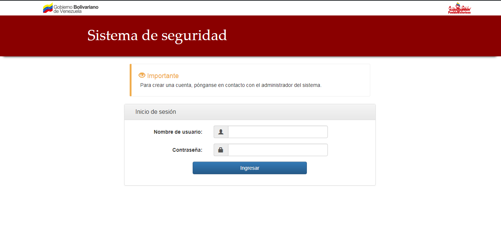
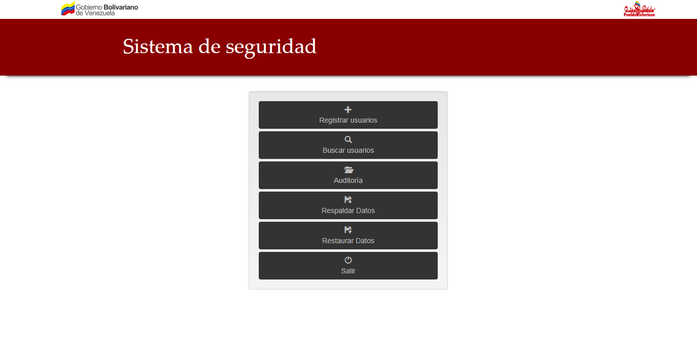
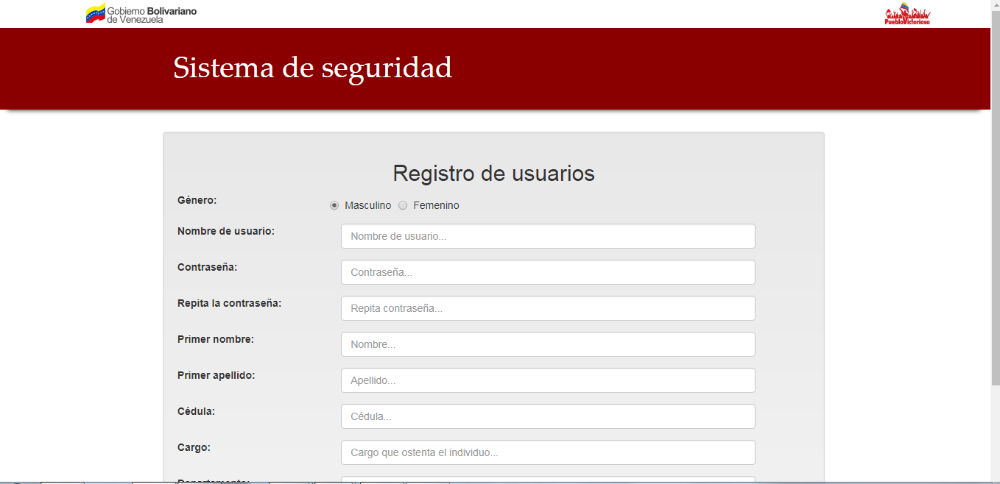
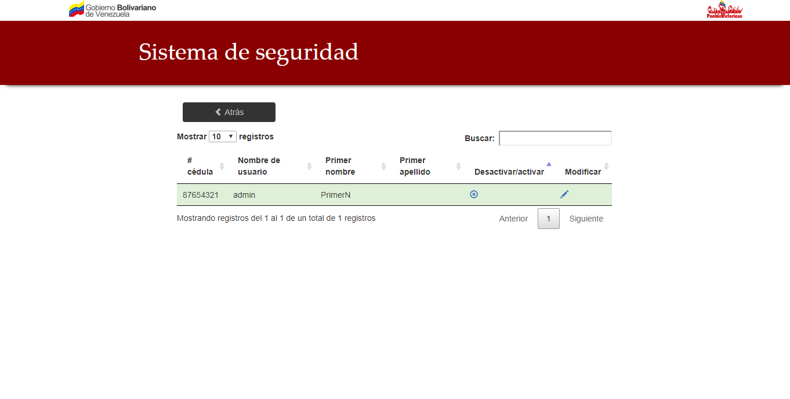

# Sistema de seguridad

## Vista previa
El sistema nace de un trabajo para la universidad, lo elaboré junto con un grupo de compañeros en el año 2016. Lo más destacable del proyecto es el uso del patrón MVC y la integración con librerías externas para resolver problemas particulares.

## Enunciado del problema

Una institución posee una gerencia de seguridad y entre sus funciones se encuentra mantener un registro de los actos delictivos que se produzcan en la institución. La manera como llevan a cabo estos registros es manual, es decir, los encargados en la gerencia de Seguridad llenan planillas donde se registran los datos del presunto delincuente o víctima, y de los hechos delictivos que tomaron lugar. Estas planillas, una vez que ya tengan los datos necesarios, son archivadas para su posterior uso. En caso de que un ciudadano vuelva a incurrir en un delito y se tenga registros previos de ese ciudadano los encargados de Seguridad entregan al ciudadano a la Policía para que tomen las acciones pertinentes. Este proceso genera documentos (denominados “actas de caución o notificación”) cuya cantidad aumenta con el tiempo y en consecuencia el proceso de consulta tiende al desorden y al aumento del tiempo de búsqueda. También existen ocasiones en el que no se logran encontrar los documentos a tiempo, provocando que un presunto delincuente salga impune.

El propósito de este sistema es disminuir el tiempo de búsqueda de las actas de caución y notificación, permitiendo que el proceso se realice de forma más rápida y que los delincuentes no salgan impunes. 

## Requerimientos

*  PostgreSQL versión 9.4.9 o superior
* WAMP server versión 2.2 o superior / XAMP server versión 5.5.38 o superior
* Se necesita activar las siguientes extenciones de PHP: session, PDO, pgsql, y pdo_pgsql.  

## Instalación

* Abrimos el sistema gestor de base de datos (postgres en nuestro caso) y creamos una nueva base de datos con el nombre: “Sistema_de_seguridad” (respetando mayúsculas y minúsculas).
* Ejecutamos el script denominado “BDD.sql” en el sistema gestor de base de datos  (el script se encuentra en la carpeta del sistema.)
* Copiamos la carpeta del sistema en el servidor local ("www" en el caso de WAMP y "htdocs" en el caso de XAMP) y ejecutamos el servidor.
* A trvez del navegador accedemos al sistema (mediante una URL similar a esta: "http://localhost/sistema%20V3.7.4/Sistema%20de%20seguridad/Default/")

## Tecnología usada

* PHP
* JavaScript
* JQuery
* JQuery UI
* HTMLToPDF
* FPDF
* Validate js
* Chart js
* Bootstrap 3
* DataTables js

## Funcionalidades del sistema

* Manejar usuarios 
* CRUD para las "actas de cauciones y las de notificaciones"
* Mostrar gráficos
* Respaldo y restauración de los datos de la base de datos
* Busquedas con filtros
* Auditoría simple
* Elaboración de reportes en PDF

## Conclusiones y recomendaciones

El sistema es completamente funcional pero bastante "artesanal". Actualmente (2018) lo mejor es usar frameworks que estandaricen el trabajo como podría ser Laravel en el caso de usar PHP o spring en el caso de Java. 

Por otra parte en lo que respecta a la arquitectura una buena opción es crear una API REST para encargarse del manejo de datos y uno o varios clientes (Angular, aplicación móvil, etc) para que interactuen con el usuario final y la API. Esto permite que la aplicación sea más escalable y facil de mantener. 

## Capturas

